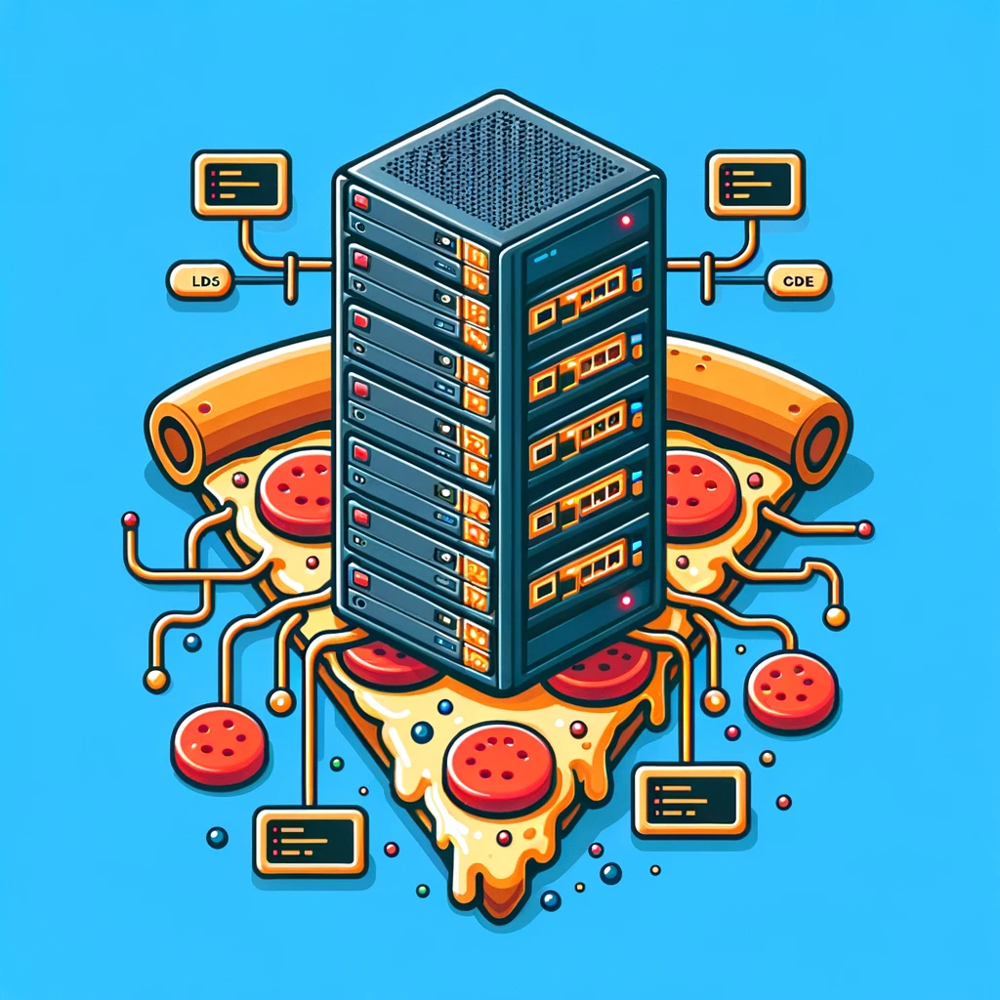

# Pizzaria Backend em Node.js :pizza::computer:
Bem-vindo ao repositório do sistema de backend para pizzarias que estão prontas para levar a eficiência da cozinha italiana tradicional para a nuvem! :cloud: Este projeto é uma solução de backend robusta e saborosa, projetada especificamente para atender aos pedidos realizados em pizzarias.

## Sobre o Projeto :notebook_with_decorative_cover:

Nosso backend é como a massa de uma pizza: flexível, essencial e a base para algo incrível. Feito com Node.js, ele está pronto para lidar com tudo, desde pedidos online até gerenciamento de inventário de ingredientes.

### Características :star2:

- **Gerenciamento de Pedidos:** API intuitiva para receber e processar pedidos em tempo real.
- **Integração com o Forno:** Sincronize os pedidos recebidos diretamente com o forno da cozinha, otimizando o tempo de preparo.
- **Inventário Inteligente:** Mantenha-se atualizado sobre seus ingredientes, nunca deixando a mussarela ou a farinha acabarem.
- **Relatórios Detalhados:** Análise de dados de vendas para ajudar a entender quais sabores fazem mais sucesso.

### Começando :rocket:

Para começar a usar este backend, clone o repositório, instale as dependências e inicie o servidor com os seguintes comandos:

```bash
git clone https://github.com/seu-usuario/pizzaria-backend.git
cd pizzaria-backend
npm install
npm start
```

### Contribuições :handshake:

Contribuições são o que fazem a comunidade open-source um lugar tão incrível para aprender, inspirar e criar. Quaisquer contribuições que você fizer serão **muito apreciadas**.

---

Sinta-se livre para personalizar o conteúdo acima para se adequar melhor ao seu projeto!

Aqui está uma imagem divertida que pode complementar a descrição do seu projeto:




Description by ChatGPT hahaha
Project by: Matheus Souza
